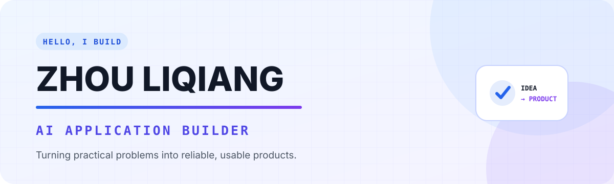
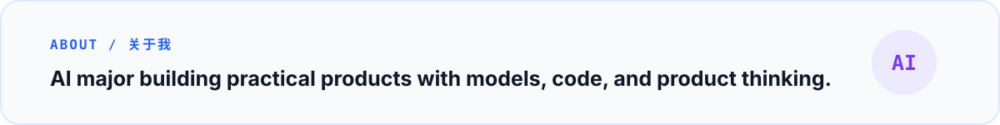
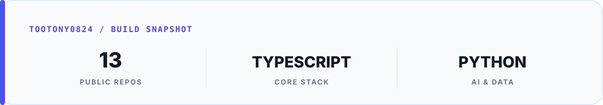

<picture>
  <source media="(prefers-color-scheme: dark)" srcset="./assets/profile-hero-dark.svg" />
  <source media="(prefers-color-scheme: light)" srcset="./assets/profile-hero-light.svg" />
  
</picture>

  
  
  
  
  

<picture>
  <source media="(prefers-color-scheme: dark)" srcset="./assets/profile-intro-dark.svg" />
  <source media="(prefers-color-scheme: light)" srcset="./assets/profile-intro-light.svg" />
  
</picture>

**Currently exploring:** AI agents, reliable application architecture, and human-friendly creative tools.

[Repositories](https://github.com/tootony0824?tab=repositories) · [PinBean](https://github.com/tootony0824/Pinbean) · [Claude Notifier](https://github.com/tootony0824/claude-notifier-macos)

---

### `// SELECTED_WORK` · Selected work

<table>
  <tr>
    <td colspan="2" valign="top">
      <code>FLAGSHIP / 01</code>
      <h3>🫘 PinBean</h3>
      
<strong>A cross-platform workspace that turns images into practical bead patterns.</strong>

      
Shared deterministic core, palette mapping, editing history, material planning, board exports, and Web/WeChat clients.

      
<code>TypeScript</code> <code>Vue</code> <code>Next.js</code> <code>Canvas</code>

      <a href="https://github.com/tootony0824/Pinbean">Public prototype →</a>
    </td>
  </tr>
  <tr>
    <td width="50%" valign="top">
      <code>ENTERPRISE AI / 02</code>
      <h3>💬 Quotation Agent</h3>
      
<strong>An enterprise WeChat assistant for product search and quotation workflows.</strong>

      
Built around maintainable product data, manual overrides, and dependable query paths.

      
<code>Python</code> <code>SQLite</code> <code>WeCom</code>

      Private production project
    </td>
    <td width="50%" valign="top">
      <code>DEVELOPER TOOL / 03</code>
      <h3>🔔 Claude Notifier</h3>
      
<strong>A tiny native macOS notification helper for Claude Code hooks.</strong>

      
Uses the native notification framework for input, permission, and completion events.

      
<code>Swift</code> <code>macOS</code> <code>Claude Code</code>

      <a href="https://github.com/tootony0824/claude-notifier-macos">Repository →</a>
    </td>
  </tr>
  <tr>
    <td colspan="2" valign="top">
      <code>SPEECH AI / 04</code>
      <h3>🎙️ Cantonese VAD</h3>
      
<strong>An experiment in Cantonese endpoint detection.</strong>

      
<code>Python</code> <code>Speech</code> <code>VAD</code>

      <a href="https://github.com/tootony0824/cantonese-vad">Repository →</a>
    </td>
  </tr>
</table>

 

### `// GITHUB_SNAPSHOT` · GitHub snapshot

  <picture>
    <source media="(prefers-color-scheme: dark)" srcset="./assets/github-snapshot-dark.svg" />
    <source media="(prefers-color-scheme: light)" srcset="./assets/github-snapshot-light.svg" />
    
  </picture>

 

### `// CONTRIBUTION_SIGNAL` · Keep shipping

<picture>
  <source media="(prefers-color-scheme: dark)" srcset="https://raw.githubusercontent.com/tootony0824/tootony0824/output/github-contribution-grid-snake-dark.svg" />
  <source media="(prefers-color-scheme: light)" srcset="https://raw.githubusercontent.com/tootony0824/tootony0824/output/github-contribution-grid-snake.svg" />
  
</picture>

   
  <strong>Build useful things. Explain them honestly. Keep improving.</strong>

